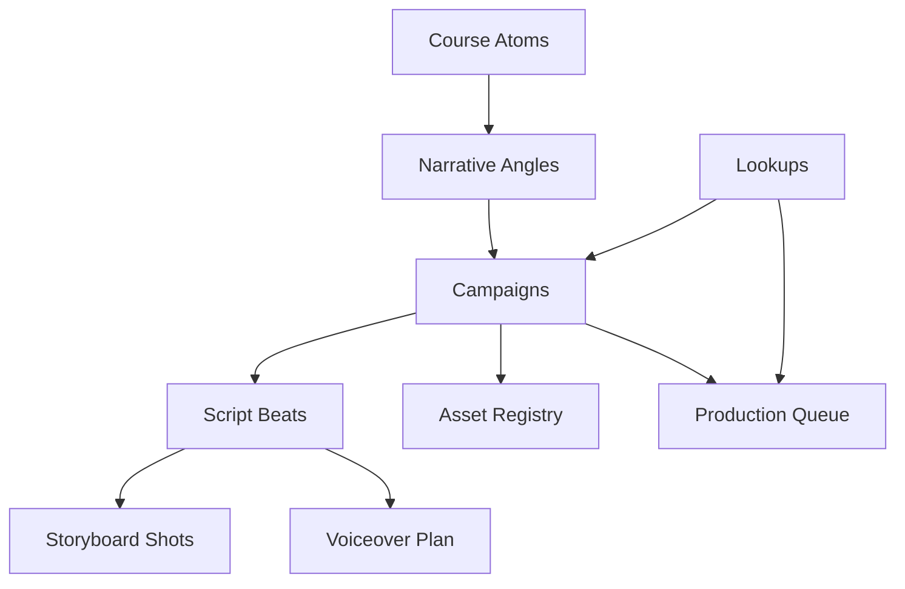

# AutoNateAI Promo Video Operating System

Live planning sheet:
<https://docs.google.com/spreadsheets/d/1g1YHiJ81R2PHXEJZ7GyzuKXKkF_YrG9w69CrhqDvuRw/edit?usp=drivesdk>

## Why this exists

The workshop portal already contains the raw ingredients for strong promo video production:

- a defined student course arc in `src/data/tracks.js`
- six student workflow offers in `src/data/workflows.js`
- lecture voiceover assets in `public/audio/lectures/student/`
- storyboard manifests in `src/data/slideStoryboards.js`
- storyboard generation configs in `config/storyboards/`

That means we should not invent promo videos from scratch. We should mine the course for repeatable promo atoms, turn those atoms into scripts and storyboard beats, then render with the existing Remotion-oriented workflow in `content-creator` plus the local promo-video skills.

## What the student course actually says

The student track is not generic study-help content. It is a narrative transformation system with a clear promise:

1. Section 1 establishes the pain: students are overloaded, not lazy.
2. Section 2 reframes tool fear: the terminal is emotional friction, not proof that the student is not technical.
3. Section 3 installs the mental model: spreadsheets are thinking tools and AI should hold painful cognition.
4. Section 4 delivers the productized offer: six Thinking Systems for concrete pressure points.
5. Section 5 closes on identity change: the gap is not intelligence, it is infrastructure.

This is strong promo material because it contains:

- a sharp enemy: overload without structure
- a memorable thesis: the gap is infrastructure
- a clear before/after transformation
- six feature-level offers that can become shorts
- existing audio and storyboard assets that reduce production cost

## Promo ladder

We should build promo content in layers instead of treating every video like a one-off.

| Layer | Goal | Source material | Runtime |
| --- | --- | --- | --- |
| Hero trailer | Sell the Student OS premise | Sections 1, 3, 5 | 45-60s |
| Setup short | Reduce tool fear | Section 2 | 20-40s |
| Thinking Systems trailer | Show the full offer stack | Section 4 | 45-60s |
| Pain-point shorts | Convert by problem awareness | Individual workflows | 20-30s |
| CTA closers | Push workshop action | Section 5 | 15-20s |

Recommended first three campaigns:

| Campaign ID | Purpose | Core hook |
| --- | --- | --- |
| `STU-HERO-001` | flagship lead-gen trailer | Most students are not disorganized. They are overloaded. |
| `STU-SYS-001` | first workflow conversion asset | Your day is not failing because you lack discipline. It is failing because it has no operating layer. |
| `STU-INSTALL-001` | setup-friction reducer | The terminal is dramatic, not evil. |

## Production system

The pipeline should work like this:

1. Extract story acts, workflow promises, and proof points from the portal.
2. Store them as reusable course atoms in the Google Sheet.
3. Select one audience problem and one conversion goal.
4. Turn that into script beats.
5. Generate or reuse storyboard frames.
6. Generate voiceover timed to beats.
7. Assemble in Remotion with deterministic scene timing.
8. QA the render, then ship to the website, social, or onboarding flows.

## Where the existing repos fit

### `autonateai-workshop-portal`

This repo is the source of truth for promo content:

- `src/data/tracks.js` holds the lecture arc and transformation narrative.
- `src/data/workflows.js` holds the productized sheet offers and prompt-pack framing.
- `src/data/voiceovers.js` maps slides to lecture audio files.
- `src/data/slideStoryboards.js` maps slides to storyboard image sequences and cue points.
- `config/storyboards/student-storyboard-plan.mjs` holds visual scene definitions for the student track.

### `content-creator`

This repo is the production workspace for building or revising promo videos:

- `content-creator/.codex/skills/remotion-thought-experiment/SKILL.md` is useful when the source of truth is a local scene spec.
- the local `remotion-promo-workflow` skill is the operating pattern for timing, voiceover verification, background music, render QA, and asset replacement.

Practical split:

- portal repo = truth, messaging, assets, and course structure
- content-creator = build space for promo compositions and renders

## Data model in the Google Sheet

The sheet is the operating layer for promo production:

Tabs and purpose:

| Tab | Purpose |
| --- | --- |
| `Campaigns` | master list of videos with goals, audience, promise, runtime, CTA, and priority |
| `Course Atoms` | reusable narrative and workflow units extracted from the course |
| `Narrative Angles` | hook-level variants tied to campaign IDs |
| `Script Beats` | the actual beat-by-beat promo script plan |
| `Storyboard Shots` | shot definitions tied to beats and source frames |
| `Voiceover Plan` | narration text, estimated words, target seconds, and output file path |
| `Asset Registry` | image/audio/source-path inventory for each campaign |
| `Production Queue` | execution status, blockers, next actions, and readiness |
| `Lookups` | controlled vocab for track, status, video type, and distribution |

The current sheet already includes starter formulas for:

- campaign priority scoring
- angle scoring
- estimated word counts and runtime
- shot IDs
- voiceover IDs
- queue readiness

## How we should turn course content into promo content

### Hero trailer

Use the student arc as a three-move promo:

1. Pain: overloaded students are drowning in unstructured pressure.
2. Reframe: the issue is not intelligence, motivation, or raw effort.
3. Offer: AI plus Thinking Systems creates a visible operating layer.

Best source pool:

- Section 1 for emotional hook
- Section 3 for belief shift
- Section 5 for CTA and identity transformation

### Setup short

Use Section 2 almost directly. This content is valuable because it removes a major adoption blocker. It should feel practical, calm, and slightly funny.

### Workflow shorts

Each Thinking System should become its own short. Each short should map:

- pain pattern
- system name
- visible sheet columns
- before/after state
- one call to action

Example:

- `Daily Time Grid` = impossible day -> visible operating grid
- `Assignment Sprint Planner` = giant assignment -> execution stairs
- `Reading Capture Matrix` = reading without retention -> structured understanding
- `Study Heatmap Board` = everything feels important -> ranked study plan
- `Paper Source Matrix` = scattered sources -> visible research map
- `Day Debrief Lab` = repeating bad days -> compounding feedback loop

## Build rules

1. Use the portal content as canonical message source.
2. Keep promos anchored to one pain point and one promise.
3. Reuse existing storyboard frames whenever possible before generating new art.
4. Keep timing deterministic. Scene lengths should follow real voiceover duration, not guessed fallbacks.
5. Treat the Google Sheet as the handoff contract between content strategy and video production.

## Immediate next builds

1. Finish the remaining beats for `STU-HERO-001` in `Script Beats`.
2. Pull the matching source frames from the student storyboard set into `Storyboard Shots`.
3. Generate voiceover files and record actual durations in `Voiceover Plan`.
4. Assemble the first Remotion promo in `content-creator`.
5. Publish the render into the real website asset path once QA passes.

## Expansion path

After the student promos are working, the exact same sheet model can be cloned for the researcher track. The structure is already parallel enough in the portal for that to be straightforward.
